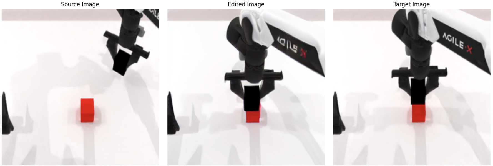

# **InstructPix2Pix Fine-tuning for Robotic Action Frame Prediction**

This project demonstrates how to fine-tune the [`InstructPix2Pix`](https://github.com/timothybrooks/instruct-pix2pix) model using [`Hugging Face Accelerate`](https://github.com/huggingface/accelerate) using simulation data of robotic manipulation tasks.

It is designed to work with camera-based robotic demonstrations and tasks such as block hammering, handover, and stacking.

## 🔗 Resources

- 📂 **Dataset**  
  Our robotic manipulation dataset is publicly available on the Hugging Face Hub:  
  👉 [https://huggingface.co/datasets/yutengz/robotic-manipulation-dataset](https://huggingface.co/datasets/yutengz/robotic-manipulation-dataset)

- 🧠 **Fine-tuned Model**  
  The InstructPix2Pix model fine-tuned on our dataset is hosted at:  
  👉 [https://huggingface.co/yutengz/ip2p-RoboPredict](https://huggingface.co/yutengz/ip2p-RoboPredict)

- 🚀 **Interactive Demo**  
  You can try our model directly in your browser via Hugging Face Spaces:  
  👉 [https://huggingface.co/spaces/yutengz/ip2p-RoboPredict](https://huggingface.co/spaces/yutengz/ip2p-RoboPredict)


## 📷 Example Result

Below is an example of source → generated → target result after fine-tuning:



## **🖥️ Hardware and Environment Requirements**

- **GPU:** A GPU with **at least 20 GB of VRAM** is required to successfully run this model.
- **CUDA version:** 12.2 (recommended)
- **Operating system:** Ubuntu 22.04
- **Python version:** 3.10 (used in conda environment)


## **🚀 Getting Started**

### Clone the Repository

```bash
git clone https://github.com/yutengzhang03/ip2p-finetune.git
cd ip2p-finetune
```

### Install Dependencies

We recommend using a virtual environment:

```bash
conda create -n ip2p python=3.10 -y
conda activate ip2p

pip install -r requirements.txt
```

### Configure Accelerate (if you haven’t already)

```bash
accelerate config
```

Here is a sample configuration for a single-GPU setup:

```bash
compute_environment: LOCAL_MACHINE
debug: false
distributed_type: 'NO'
downcast_bf16: 'no'
enable_cpu_affinity: false
gpu_ids: '0'
machine_rank: 0
main_training_function: main
mixed_precision: 'no'
num_machines: 1
num_processes: 1
rdzv_backend: static
same_network: true
tpu_env: []
tpu_use_cluster: false
tpu_use_sudo: false
use_cpu: false
```

## 🧾 Dataset Preparation

### Step 0: Prepare Dataset (Example: Our dataset)

Login in huggingface:

```bash
huggingface-cli login --token=<paste-your-token>
```

Run the following commmand to download our dataset:

```bash
python download_dataset.py
```

### Step 1: Create a Dataset from .pkl Files

Put your raw `.pkl` simulation data in the `original_data/` folder. (Our dataset is automatically saved in this folder if you follow the above steps)

#### 📂 Dataset Structure 

<pre>
📁 original_data/
  ├── 📁 block_hammer_beat_sf50_D435_pkl/
  │ ├── 📁 episode0/
  │ │ ├── 0.pkl
  │ │ ├── 1.pkl
  │ │ └── ...
  │ ├── 📁 episode1/
  │ │ └── ...
  │ └── ...
  ├── 📁 block_handover_sf50_D435_pkl/
  │ └── 📁 episode0/...
  ├── 📁 blocks_stack_easy_sf50_D435_pkl/
  │ └── 📁 episode0/... 
</pre>

#### Training dataset

Run the following commands to create the training dataset

```bash
accelerate launch create_ip2p_dataset.py \
  --samples_per_task 100 \
  --frame_gap 50 \
  --save_path data \
  --tasks \
  block_hammer_beat_sf50_D435_pkl="beat the block with the hammer" \
  block_handover_sf50_D435_pkl="handover the blocks" \
  blocks_stack_easy_sf50_D435_pkl="stack blocks" \
  --metadata_filename train_dataset.json
```

- `--metadata_filename` followed by the output path
  This will create:

  `data/0000/source.jpg`, `data/0000/target.jpg`, ...

- A `train_dataset.json` file describing each pair and prompt.

- Example entry `train_dataset.json`:

```json
{
  "image": "data/0000/source.jpg",
  "edited_image": "data/0000/target.jpg",
  "prompt": "Beat the block with the hammer"
}
```

#### Validation and Testing Dataset

You can change the `--samples_per_task` and `--metadata_filename` to create the valiadation dataset and test dataset.

For example:

```bash
accelerate launch create_ip2p_dataset.py \
  --samples_per_task 20 \
  --frame_gap 50 \
  --save_path data \
  --tasks \
  block_hammer_beat_sf50_D435_pkl="beat the block with the hammer" \
  block_handover_sf50_D435_pkl="handover the blocks" \
  blocks_stack_easy_sf50_D435_pkl="stack blocks" \
  --metadata_filename val_dataset.json
```

```bash
accelerate launch create_ip2p_dataset.py \
  --samples_per_task 20 \
  --frame_gap 50 \
  --save_path data \
  --tasks \
  block_hammer_beat_sf50_D435_pkl="beat the block with the hammer" \
  block_handover_sf50_D435_pkl="handover the blocks" \
  blocks_stack_easy_sf50_D435_pkl="stack blocks" \
  --metadata_filename test_dataset.json
```

## 🗂️ Project Structure 

```
.
|-- LICENSE
|-- README.md
|-- configs
|   |-- generate.yaml
|   `-- train.yaml
|-- create_ip2p_dataset.py
|-- data
|-- dataset_creation
|   |-- generate_img_dataset.py
|   |-- generate_txt_dataset.py
|   |-- prepare_dataset.py
|   `-- prepare_for_gpt.py
|-- download_dataset.py
|-- edit_app.py
|-- edit_cli.py
|-- edit_dataset.py
|-- environment.yaml
|-- evaluate_metrics.py
|-- fine-tune-ip2p-full.py
|-- fine-tune-ip2p.py
|-- imgs
|-- inference.ipynb
|-- ip2p-finetune-output
|-- main.py
|-- metrics
|   |-- clip_similarity.py
|   `-- compute_metrics.py
|-- original_data
|-- process_dataset.ipynb
|-- prompt_app.py
|-- requirements.txt
|-- scripts
|   |-- download_checkpoints.sh
|   |-- download_data.sh
|   `-- download_pretrained_sd.sh
|-- stable_diffusion
|-- structure.txt
|-- test_dataset.json
|-- train_dataset.json
`-- val_dataset.json
```
In addition to the files we provide, other files are from [InstructPix2Pix](https://github.com/timothybrooks/instruct-pix2pix).

## 🧪 Fine-Tune InstructPix2Pix Model

### Non-distributed Training

After preparing the dataset, you can fine-tune the model using:

```bash
accelerate launch fine-tune-ip2p.py \
  --pretrained_model_name_or_path="timbrooks/instruct-pix2pix" \
  --train_data_dir="train_dataset.json" \
  --validation_data_dir="val_dataset.json" \
  --resolution=256 \
  --random_flip \
  --train_batch_size=4 \
  --gradient_accumulation_steps=4 \
  --num_train_epochs=10 \
  --checkpointing_steps=500 \
  --learning_rate=1e-5 \
  --lr_scheduler="constant" \
  --lr_warmup_steps=0 \
  --mixed_precision="fp16" \
  --output_dir="./ip2p-finetune-output" \
  --seed=42 \
  --original_image_column="image" \
  --edited_image_column="edited_image" \
  --edit_prompt_column="prompt"
```

The model and a training and validation loss plot will be saved at `--output_dir`.

If you don't have a validation dataset, delete `--validation_data_dir="val_dataset.json" \`

### Training with multiple GPUs

`accelerate` allows for seamless multi-GPU training. Follow the instructions [here](https://huggingface.co/docs/accelerate/basic_tutorials/launch)
for running distributed training with `accelerate`. Here is an example command:

```bash
accelerate launch fine-tune-ip2p.py \ --multi_gpu
  --pretrained_model_name_or_path="timbrooks/instruct-pix2pix" \
  --train_data_dir="train_dataset.json" \
  --validation_data_dir="val_dataset.json" \
  --resolution=256 \
  --random_flip \
  --train_batch_size=4 \
  --gradient_accumulation_steps=4 \
  --num_train_epochs=10 \
  --checkpointing_steps=500 \
  --learning_rate=1e-5 \
  --lr_scheduler="constant" \
  --lr_warmup_steps=0 \
  --mixed_precision="fp16" \
  --output_dir="./ip2p-finetune-output" \
  --seed=42 \
  --original_image_column="image" \
  --edited_image_column="edited_image" \
  --edit_prompt_column="prompt"
```

### Full fine-tuning

We also provide methods for full fine-tuning. 
Though not recommended for this task, you can try on other projects.

```bash
accelerate launch fine-tune-ip2p-full.py \
  --pretrained_model_name_or_path="timbrooks/instruct-pix2pix" \
  --train_data_dir="train_dataset.json" \
  --validation_data_dir="val_dataset.json" \
  --resolution=256 \
  --random_flip \
  --train_batch_size=4 \
  --gradient_accumulation_steps=4 \
  --num_train_epochs=10 \
  --checkpointing_steps=500 \
  --learning_rate=1e-5 \
  --lr_scheduler="constant" \
  --lr_warmup_steps=0 \
  --output_dir="./ip2p-finetune-output" \
  --seed=42 \
  --original_image_column="image" \
  --edited_image_column="edited_image" \
  --edit_prompt_column="prompt"
```

## 📊 Evaluate the Model

We evaluate the model using **SSIM (Structural Similarity Index)** and **PSNR (Peak Signal-to-Noise Ratio)** metrics.

To run the evaluation:

```bash
python evaluate_metrics.py \
  --test_data_dir test_dataset.json \
  --model_path "./ip2p-finetune-output"
```

#### Visualization
To visualize the exact performance of the finetuned model, use `inference.ipynb`

